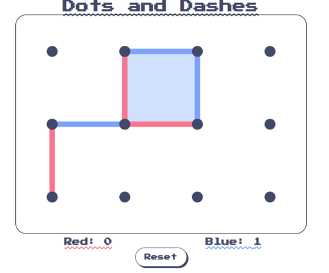

# Dots and Dashes

## Introduction

Welcome to Dots and Dashes, a fun and engaging game where players take turns connecting dots with lines to form squares. 
The player who manages to make a square gets a point. The player with the most points wins!!!

## Demo

Check out the live version of the project on  
https://dotsndashes.netlify.app/

 
 
## How to Play

1. Players take turns drawing lines between adjacent dots.
2. When a player completes a square, they score a point and take another turn.
3. The game ends when all possible squares are claimed, and the player with the higher score wins.

## Requirements

This game works on almost any mobile and computer devices

## Technologies Used

**HTML** and **CSS*** for structure and styling of the game
**JavaScript** for game logic and interactivity.
